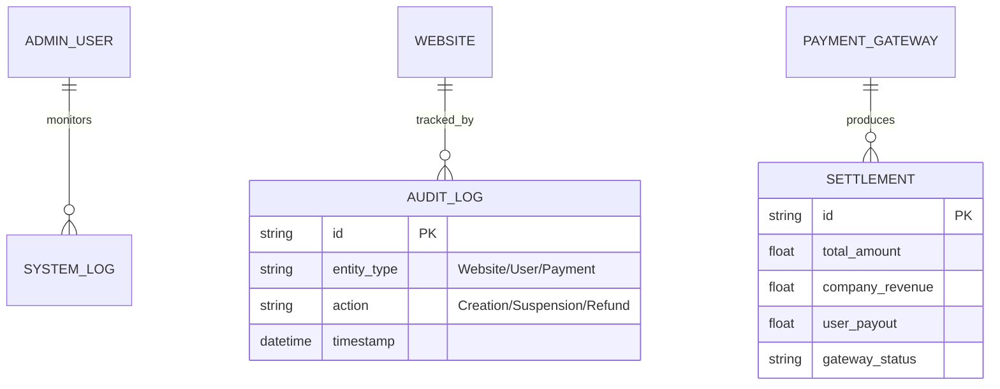

# PRD - Dashboard Administrativo (Controle Interno)

## 1. Visão Geral
Este documento define as funcionalidades do painel administrativo interno, destinado aos gestores da plataforma para monitoramento de métricas, moderação e gestão financeira.

## 2. Stack Tecnológica (Referência Interna)
- **Runtime:** Node.js v18.20.8 (LTS).
- **Frontend Framework:** React 19 (SPA).
- **Build Tool:** Vite.
- **Linguagem:** TypeScript.
- **Animações:** Framer Motion.
- **Ícones:** Lucide React.
- **Gerenciador de Pacotes:** NPM.

## 3. Gestão Financeira (Pagar.me Focus)
- **Monitoramento de Vendas:** Visão em tempo real de transações de planos Premium e taxas de listas de presentes.
- **Gestão de Splits:** Visualização de quanto foi retido pela plataforma vs. quanto foi repassado aos casais.
- **Estornos e Disputas:** Interface centralizada para gerenciar reembolsos via checkout Pagar.me.
- **Painel de Recebedores:** Status das contas dos casais (verificadas/pendentes de KYC).

## 3. Gestão de Usuários e Sites
- **Visualização Global:** Lista de todos os usuários, seus sites vinculados e status do plano (Free/Premium).
- **Moderação de Conteúdo:** Capacidade de suspender sites que infrinjam termos de uso.
- **Suporte Técnico:** Acesso aos logs de erros e configurações de site para auxílio ao usuário.

## 4. Métricas e BI (Business Intelligence)
- **MRR / ARR:** Receita recorrente mensal e anual das assinaturas Premium.
- **Taxa de Conversão:** Quantos usuários Free migram para o Premium.
- **Churn Rate:** Cancelamentos de assinaturas.
- **Uso de IA:** Custo total vs. receita gerada pela funcionalidade de IA.

## 5. Gestão de Templates e IA
- **Métricas de Performance:** Quais templates são mais utilizados.
- **Tuning de LLM:** Ajuste de prompts globais usados na geração de sites.

## 6. Diagrama de Dados Administrativo (Mermaid)

