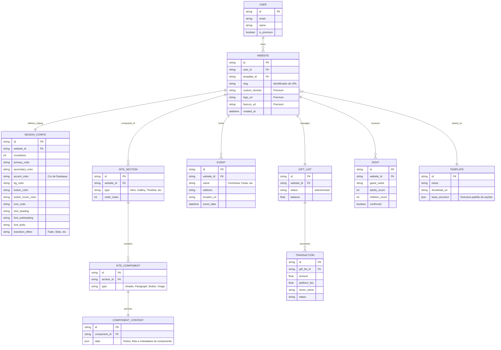

# PRD - Plataforma de Sites para Eventos (Casamento, Noivado, etc.)

## 1. Visão Geral
A plataforma tem como objetivo facilitar a criação de sites personalizados para casais que vão namorar, noivar ou casar. Oferecemos duas formas de criação: via Inteligência Artificial (sob demanda) ou através de templates pré-definidos.

## 2. Público-Alvo
- Casais em fase de namoro, noivado ou preparativos para o casamento.
- Pessoas que buscam organizar listas de presentes e confirmação de presença (RSVP) de forma digital e centralizada.

## 3. Funcionalidades Principais

### 3.1. Criação e Customização do Site
- **Templates:** Seleção de modelos pré-configurados de alta fidelidade.
- **Criação com IA:** Geração dinâmica de conteúdo, estrutura e sugestão de design via IA.
  - *Modelo de Cobrança:* "Pay-per-use" por geração/regeneração.
- **Customização Total (Design System):**
  - **Identidade Visual Core:** Ajuste global de "Roundness" (bordas), sombras e espaçamentos.
  - **Paleta de Cor Estendida:** Definição de cores de Background, Superfície (Cards), Texto, e **Cor de Destaque (Accent color)**.
  - **Elementos de UI:** Customização individual de cores e estados (hover/active) para **Botões** e **Ícones**.
  - **Tipografia:** Configuração de até 3 fontes (Heading, Subheading, Body) integradas via Google Fonts ou similar.
  - **Efeitos e Transições:** Controle de animações de entrada (fade, slide) e efeitos de transição global entre seções do site.

### 3.2. Estrutura de URL e Navegação
- **Identificador Único (Slug):** Cada site possuirá um `slug` único (ex: `meu-casamento-2026`) que compõe a URL padrão da plataforma.
- **Domínio Personalizado (Premium):** Mapeamento de domínios próprios (CNAME) para usuários premium.

### 3.3. Persistência Granular de Dados (Banco de Dados)
Para garantir a fidelidade da exibição, todas as decisões de design e conteúdo devem ser persistidas de forma estruturada:
- **Design Tokens:** Salvamento de todos os valores de CSS dinâmico (cores, roundness, tipografia, efeitos).
- **Mapeamento de Conteúdo (Textos):** Persistência completa de textos mapeados por **Sessão** (ex: Hero, Galeria, RSVP) e **Componente** (ex: Título do Banner, Descrição da Festa, Label de Botão). Isso permite edições precisas e regeneração parcial via IA.

### 3.4. Experiência de Exibição e Inicialização
- **Hydration de Estilos:** Ao carregar o site via `slug`, a aplicação deve injetar os design tokens e textos salvos antes da renderização final para evitar "flickering".
- **Ativação Premium:** Inicialização automática de recursos como Favicon personalizado, remoção de branding da plataforma e SSL no domínio próprio.

### 3.5. Lista de Presentes e Transações (Integração Pagar.me)
- **Gateways de Pagamento:** Uso da infraestrutura da Pagar.me para processamento de Cartão de Crédito e PIX.
- **Split de Pagamento:** Divisão automática entre o valor do presente (para o casal) e a taxa da plataforma (nosso lucro) no momento do checkout.
- **Recebedores (Recipients):** Criação de contas digitais vinculadas para os casais receberem os valores, garantindo conformidade com o Banco Central.
- **Segurança:** Uso de PCI Compliance através da Pagar.me.

### 3.6. RSVP e Gestão de Eventos
- Sistema de confirmação de presença com campos customizáveis.
- Gestão de múltiplos sub-eventos (Cerimônia, Recepção, After-party) com endereços e geo-localização integrados.

### 3.7. Galeria de Mídia de Próxima Geração
- **Nível Free:** Integração via links externos (Embeds/URLs). Sem custo de armazenamento para a plataforma.
- **Nível Premium:** Upload nativo, compressão automática de imagem para web e CDN dedicada.

## 4. Planos e Monetização

### 4.1. Versão Gratuita (Free)
- Acesso a templates básicos.
- Galeria via URLs externas.
- Lista de presentes com cobrança de taxa transacional.

### 4.2. Versão Premium
- **Customização de Marca:** Troca de logo e favicons.
- **Domínio Personalizado:** Uso de domínio próprio do usuário.
- **Hospedagem de Mídia:** Armazenamento nativo de fotos e vídeos.
- **IA:** Créditos extras ou descontos na geração de sites com IA.

### 4.3. Modelo de Receita
- **Taxa Transacional:** Percentual sobre a lista de presentes em dinheiro.
- **Pay-per-use:** Cobrança por cada geração de site via IA.
- **Assinatura Premium:** Valor fixo para desbloqueio de funcionalidades avançadas.

## 5. Requisitos Técnicos e Integrações
- **Processamento de Pagamentos:** Integração com Stripe (para taxas e planos premium).
- **IA:** Integração com LLMs para geração de conteúdo.
- **Domínios:** Sistema de mapeamento de domínios personalizados para usuários premium.

## 6. Diagrama de Dados (Mermaid)

